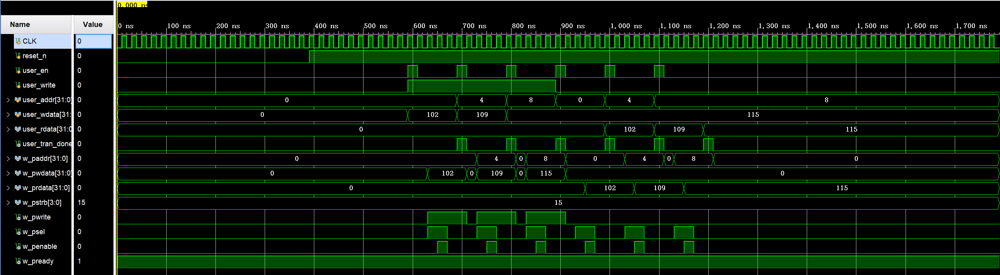

# APB 总线子系统

## 设计功能

**Master 模块 (APB_Master)**
- 支持用户发起读写传输（user_en 脉冲触发）
- 自动完成 APB 协议时序（SETUP 周期 + ACCESS 周期）
- 传输完成后输出 user_tran_done 脉冲
- 读操作返回 user_rdata

**Slave 模块 (APB_Slave)**
- 内部 1024×32bit 存储空间，复位初始化为 0xA5A5A5A5
- 支持 PSTRB 字节写（4 个字节独立控制）
- 无等待传输（PREADY 恒为 1）
- 读操作返回 PRDATA

**顶层模块 (APB_top)**
- 例化 Master 和 Slave
- 连接 APB 总线信号

## 验证方法

- 仿真环境：Vivado 自带仿真器
- 测试流程：写地址 0x00=102 → 写地址 0x04=109 → 写地址 0x08=115 → 读回三个地址
- 对比写数据和读数据，完全一致

## 仿真结果

上图展示了写操作和读操作的波形：
- w_psel 和 w_penable 时序符合 APB 规范
- 写数据 w_pwdata = 102，读数据 w_prdata = 102
- 读写一致，功能正确

## 文件说明

- APB_Master.v：APB 主机模块
- APB_Slave.v：APB 从机模块
- APB_top.v：顶层连接模块
- APB_top_tb.v：仿真 testbench

## 改进方向

当前版本为无等待传输。若需支持慢速外设，可增加计数器延迟 PREADY 响应，并在 Master 中添加 WAIT 状态。

## 许可证

MIT License
